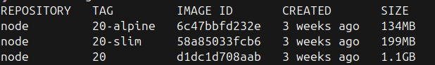

  <!-- _paginate: skip -->

  <div class="front">
    <h1 class="title"> Dockerfile Avanzado </h1>
    <hr class="line"/>
    <p class="author">Arturo Silvelo</p>
    <p class="company">Try New Roads</p>
  </div>

---

## Introducción: ¿Qué es un Dockerfile?

Un **Dockerfile** es un archivo de texto que contiene instrucciones para construir una imagen Docker. Define el sistema operativo base, las dependencias, el código fuente, variables de entorno y el comando de arranque del contenedor.

Permite automatizar la creación de entornos reproducibles y portables, facilitando el despliegue de aplicaciones en cualquier sistema compatible con Docker.

---

**Ejemplo mínimo:**

- Contenido del `Dockerfile`

  ```dockerfile
  FROM alpine:3.20
  CMD ["echo", "Hola Docker!"]
  ```

- Construcción de la imagen

  ```bash
  docker build -f 1.minimo/Dockerfile -t app-minimo 1.minimo
  ```

- Ejecución de la imagen

  ```bash
  docker run --rm app-minimo
  ```

---

## Optimización de imágenes Docker

Optimizar imágenes Docker es fundamental para mejorar el rendimiento, la seguridad y la eficiencia en el despliegue de aplicaciones. Una imagen optimizada:

- Se descarga y despliega más rápido.
- Ocupa menos espacio en disco y consume menos ancho de banda.
- Reduce la superficie de ataque y facilita la actualización.
- Es más fácil de mantener y depurar.

Para lograrlo, es importante aplicar varias técnicas y buenas prácticas, como el uso de multi-stage builds y la optimización de capas.

---

## ¿Cómo optimizar imágenes Docker?

- Usar imágenes base ligeras (alpine, slim)
- Multi-stage builds para separar dependencias de build y producción
- Minimizar el número de capas combinando instrucciones RUN, COPY, etc.
- Eliminar archivos temporales y cachés en la misma instrucción

---

<div class=image-container>



<div>

---

### Multi-stage builds

Permite crear imágenes más ligeras y seguras usando varias etapas en el Dockerfile.

- Solo la última etapa contiene lo necesario para ejecutar la aplicación.
- Las etapas previas pueden tener herramientas de compilación y dependencias de desarrollo, que no se copian a la imagen final.

---

**Ventajas:**

- Reduce el tamaño de la imagen final.
- Elimina archivos y dependencias de desarrollo.
- Nombra las etapas (`AS build`, `AS produccion`) para facilitar el copiado selectivo.
- Usa imágenes base "slim" o "alpine" cuando sea posible.

> No es necesario construir todas las fases del Dockerfile. Usando la opción --target, puedes crear una imagen solo hasta una etapa concreta.

---

<div class="container-column">

<div class="small">

- `Dockerfile.before:` Imagen sin multi-stage

  ```dockerfile
    FROM node:20
    WORKDIR /app
    COPY package*.json ./
    RUN npm install
    COPY . .
    RUN npm test
    CMD ["node", "app.js"]
  ```

- Creación:

  ```bash
  docker build -f 2.multi-stage/Dockerfile.before -t app-simple app
  ```

- Ejecución y comprobación:

  ```bash
  docker run --rm --init -p 3000:3000 app-simple
  curl http://localhost:3000
  ```

</div>

<div class="small">

- `Dockerfile.after:` Imagen con multi-stage.

  ```dockerfile
    FROM node:20 AS build
    WORKDIR /app
    COPY package*.json ./
    RUN npm install
    COPY . .

    FROM node:20 AS test
    WORKDIR /app
    COPY --from=build /app /app
    RUN npm test

    FROM node:20-alpine AS production
    WORKDIR /app
    COPY --from=build /app/app.js .
    COPY --from=build /app/package.json .
    RUN npm install --production
    CMD ["node", "app.js"]
  ```

- Creación:

  ```bash
  docker build -f 2.multi-stage/Dockerfile.after -t app-multi-stage app
  ```

- Ejecución y comprobación:

  ```bash
  docker run --rm --init -p 3000:3000 app-multi-stage
  curl http://localhost:3000
  ```

</div>

---

## Capas en Docker: ¿Qué son?

Cada instrucción (FROM, RUN, COPY, etc.) en un Dockerfile crea una **capa**.

- Las capas son archivos intermedios que Docker almacena en cache.
- Si una capa no cambia, Docker la reutiliza en builds futuros.
- Esto acelera la construcción y ahorra espacio en disco.

Ejemplo:

```dockerfile
FROM node:20  # Crea una capa
COPY . .      # Otra capa
RUN npm install  # Otra capa
```

---

## Optimización de capas: Estrategias

Optimizar el número y el contenido de las capas en tus imágenes Docker es clave para reducir el tamaño, acelerar los builds y facilitar el mantenimiento.

Algunas estrategias recomendadas son:

- **Agrupa comandos en una sola instrucción RUN:**  
  Así reduces el número de capas y aprovechas mejor la cache de Docker.
- **Elimina archivos temporales y de build en la misma RUN:**  
  Si los borras en la misma instrucción donde se crean, no quedan guardados en ninguna capa.

---

- **Incluye un archivo `.dockerignore`:**  
  Excluye archivos y carpetas que no necesitas en la imagen (tests, docs, node_modules, etc.), evitando que se copien y generen capas innecesarias.

- **El orden de las capas influye en el tiempo de build:**
  Si modificas una instrucción, todas las capas posteriores se reconstruyen. Coloca primero las instrucciones que cambian menos (por ejemplo, dependencias) y después las que cambian más (código fuente).

---

<div class="container-column">
<div class="small">

- `Dockerfile:` Imagen con capas mal optimizadas (versión original)

  ```dockerfile
  FROM node:20
  WORKDIR /app
  COPY . .
  RUN apt-get update
  RUN apt-get install -y build-essential
  RUN npm install
  RUN npm test
  CMD ["node", "app.js"]
  ```

- Creación:

  ```bash
  docker build -f 3.optimizacion-capas/Dockerfile -t app-mal-optimizado app
  ```

</div>
<div class="small">

- `Dockerfile.1-agrupa-run:` Agrupando comandos RUN

  ```dockerfile
  FROM node:20
  WORKDIR /app
  COPY . .
  RUN apt-get update && \
      apt-get install -y build-essential && \
      npm install
  RUN npm test
  CMD ["node", "app.js"]
  ```

- Creación:

  ```bash
  docker build -f 3.optimizacion-capas/Dockerfile.1 -t app-fase1 app
  ```

    </div>
  </div>

---

<div class="container-column">
<div class="small">

- `Dockerfile.2-limpieza:` Agrupando RUN y limpiando archivos temporales

  ```dockerfile
  FROM node:20
  WORKDIR /app
  COPY . .
  RUN apt-get update && \
      apt-get install -y build-essential && \
      npm install && \
      apt-get clean && \
      rm -rf /var/lib/apt/lists/*
  RUN npm test
  CMD ["node", "app.js"]
  ```

- Creación:

  ```bash
  docker build -f 3.optimizacion-capas/Dockerfile.2 -t app-fase2 app
  ```

  </div>

<div class="small">

- `Dockerfile.3-optimizado:` Capas optimizadas y bien organizadas

  ```dockerfile
  FROM node:20
  WORKDIR /app

  # Instalar dependencias del sistema primero (se cachea)
  RUN apt-get update && \
      apt-get install -y build-essential && \
      apt-get clean && \
      rm -rf /var/lib/apt/lists/*

  # Copiar solo package.json primero (mejor cache)
  COPY package*.json ./
  RUN npm install

  # Copiar código fuente al final
  COPY . .
  RUN npm test

  CMD ["node", "app.js"]
  ```

- Creación:

  ```bash
  docker build -f 3.optimizacion-capas/Dockerfile.3 -t app-fase3 app
  ```

  </div>
  </div>

---

## Variables ARG y ENV en Docker

Las variables `ARG` y `ENV` permiten personalizar tanto la construcción de la imagen como el comportamiento de los contenedores.

- **ARG** se usa para definir valores que solo existen durante el proceso de build (por ejemplo, elegir una versión de Node o una URL de descarga).
- **ENV** define variables de entorno que estarán disponibles en la imagen final y en los contenedores que se creen a partir de ella.

Estas variables ayudan a crear imágenes más flexibles, reutilizables y adaptables a diferentes entornos (desarrollo, producción, etc.).

---

## Buenas prácticas

- Usa `ARG` para valores temporales o que no deban quedar en la imagen.
- Usa `ENV` para configuración que necesita el contenedor en ejecución.
- No pongas secretos en `ENV` ni en el Dockerfile.
- Documenta las variables y su propósito.

---

<div class=container-column>
<div class=small>

- `Dockerfile:` Uso de ARG para PORT y ENV para SECRET

  ```dockerfile
  FROM node:20

  # ARG para el puerto (se puede pasar en build time)
  ARG PORT=3000

  # ENV para el secreto (variable de entorno)
  ENV SECRET="mi-secreto-por-defecto"

  # Pasar el valor de ARG a una ENV para que esté disponible en runtime
  ENV PORT=$PORT

  WORKDIR /app
  COPY package*.json ./
  RUN npm install
  COPY . .
  RUN npm test

  # Exponer el puerto
  EXPOSE $PORT

  CMD ["node", "app.js"]
  ```

- Creación con valores por defecto:

  ```bash
  docker build -f 4.arg-env/Dockerfile -t app-arg-env app
  ```

</div>
<div class=small>

- Creación con puerto personalizado:

  ```bash
  docker build -f 4.arg-env/Dockerfile --build-arg PORT=8080 -t app-arg-env-8080 app
  ```

- Verificación:

  ```bash
  # Ver variables de entorno del contenedor
  docker run --rm app-arg-env env | grep -E "(PORT|SECRET)"
  docker run --rm app-arg-env-8080 env | grep -E "(PORT|SECRET)"
  ```

- Ejecución y comprobación:

  ```bash
  docker run --rm --init -p 3000:3000 app-arg-env
  curl http://localhost:3000
  curl http://localhost:3000/secret
  docker run --rm --init -p 8080:8080 app-arg-env-8080
  curl http://localhost:8000
  curl http://localhost:8000/secret
  ```

</div>
</div>

---

## Gestión de secretos en Docker

Los secretos son datos sensibles (contraseñas, tokens, claves API, certificados, etc.) que permiten acceder a recursos protegidos. Es fundamental protegerlos y evitar que queden expuestos en la imagen o el código fuente.

En Docker, los secretos no deben almacenarse en la imagen. Deben gestionarse de forma externa y segura.

---

##### Riesgos de una mala gestión

- Los secretos quedan guardados en la imagen y pueden ser leídos por cualquiera con acceso.
- Si subes la imagen a un registro público, los secretos quedan expuestos.
- Los secretos pueden filtrarse en logs, capas intermedias o sistemas de CI/CD.

---

##### Buenas prácticas

- Nunca incluyas secretos en el Dockerfile ni en la imagen.
- Usa mecanismos externos: Docker secrets (Swarm), variables de entorno solo en ejecución, archivos montados como volúmenes.
- Usa archivos `.env` solo para desarrollo y nunca los subas a git.
- Documenta cómo inyectar los secretos en producción.

---

<div class=container-column>
<div class=small>

- `Dockerfile:` Secreto hardcodeado

  ```dockerfile
    FROM node:20

    # ENV para el secreto (variable de entorno)
    ENV SECRET="mi-secreto-por-defecto"
    ....

  ```

- Creación (mala práctica):

  ```bash
  docker build -f 5.secretos/Dockerfile -t app-secreto-malo app
  ```

- Ejecución **sin secreto** (muestra "undefined"):

  ```bash
  docker run --rm --init -p 3000:3000 app-secreto-malo
  curl http://localhost:3000/secret
  ```

- Verificación del problema de seguridad:

  ```bash
  # Ver que el secreto está expuesto en la imagen mala
  docker run --rm app-secreto-malo env | grep SECRET
  ```

</div>
<div class=small>

- `Dockerfile.1:` Sin secretos hardcodeados

  ```dockerfile
  FROM node:20
  # ENV SECRET="mi-secreto-por-defecto"
  ...
  ```

- Creación (buena práctica):

  ```bash
  docker build -f 5.secretos/Dockerfile.1 -t app-secreto-bueno app
  ```

- Ejecución con **variable de entorno**:

  ```bash
  docker run --rm --init -p 3000:3000 -e SECRET="mi-secreto-desde-env" app-secreto-bueno
  curl http://localhost:3000/secret
  ```

- Ejecución con **archivo montado**:

  ```bash
  docker run --rm --init -p 3000:3000 -v "$(pwd)/5.secretos/my_secret.txt:/run/secrets/secret.txt" app-secreto-bueno
  curl http://localhost:3000/secret
  ```

- Verificación del problema de seguridad:

  ```bash
  # Ver que no hay secreto hardcodeado en la imagen buena
  docker run --rm app-secreto-bueno env | grep SECRET
  ```

  </div>
  </div>

---

## Seguridad en Docker: Usuarios no-root

Ejecutar contenedores como usuario **root** es una práctica insegura que puede comprometer la seguridad del sistema host. Por defecto, los procesos dentro de un contenedor se ejecutan como root, lo que representa un riesgo significativo.

**¿Por qué es peligroso?**

- Si un atacante compromete el contenedor, tiene privilegios de administrador.
- Puede acceder y modificar archivos del sistema host si hay volumenes mal configurados.
- Facilita la escalada de privilegios y ataques de escape de contenedor.

---

## Buenas prácticas de seguridad

- **Crear un usuario específico** para ejecutar la aplicación.
- **Usar UIDs numéricos** en lugar de nombres para mayor compatibilidad.
- **Cambiar la propiedad de archivos** al usuario de la aplicación.
- **Usar imágenes base que ya incluyan usuarios no-root** cuando sea posible.
- **Verificar permisos** de archivos y directorios necesarios.

---

<div class="container-column">
<div class="small">

- `Dockerfile:` Aplicación ejecutándose como root (inseguro)

  ```dockerfile
  FROM node:20-alpine
  WORKDIR /app
  COPY package*.json ./
  RUN npm install --only=production
  COPY app.js .
  EXPOSE 3000
  CMD ["node", "app.js"]
  ```

- Creación y verificación:

  ```bash
  docker build -f 6.seguridad/Dockerfile -t app-inseguro app
  docker run --rm app-inseguro whoami
  docker run --rm app-inseguro id
  ```

- Resultado:

  ```bash
  $docker run --rm --init app-seguridad-root whoami
  root
  ```

</div>

<div class="small">

- `Dockerfile.1:` Aplicación con usuario no-root (seguro)

  ```dockerfile
  FROM node:20-alpine
  WORKDIR /app
  # Crear usuario y grupo no-root
  RUN addgroup -g 1001 -S nodejs && \
      adduser -S nodeuser -u 1001 -G nodejs
  # Instalar dependencias como root
  COPY package*.json ./
  RUN npm install --only=production && \
      npm cache clean --force
  # Copiar código y cambiar propiedad
  COPY app.js .
  RUN chown -R nodeuser:nodejs /app
  # Cambiar a usuario no-root
  USER nodeuser
  EXPOSE 3000
  CMD ["node", "app.js"]
  ```

- Creación y verificación:

  ```bash
  $docker build -f 6.seguridad/Dockerfile.1 -t app-seguro app
  docker run --rm app-seguro whoami
  docker run --rm app-seguro id
  ```

- Resultado:

  ```bash
  $docker run --rm --init app-seguridad-no-root whoami
  nodeuser
  ```

</div>
</div>

---

## Multi-stage optimizado con seguridad

<div class=container-column>
<div class=small>

- `Dockerfile.2` Aplicación multistage

  ```dockerfile
  FROM node:20 AS build
  WORKDIR /app
  COPY package*.json ./
  RUN npm install --only=production && npm cache clean --force

  FROM node:20 AS test
  WORKDIR /app
  COPY package*.json ./
  RUN npm ci
  COPY . .
  RUN npm test

  FROM node:20-alpine AS production
  WORKDIR /app

  # Crear usuario no-root
  RUN addgroup -g 1001 -S nodejs && \
      adduser -S nodeuser -u 1001 -G nodejs

  # Copiar solo archivos necesarios y cambiar propiedad
  COPY --from=build --chown=nodeuser:nodejs /app/node_modules ./node_modules
  COPY --from=build --chown=nodeuser:nodejs /app/package.json ./
  COPY --chown=nodeuser:nodejs app.js .

  # Cambiar a usuario no-root
  USER nodeuser

  EXPOSE 3000
  CMD ["node", "app.js"]
  ```

</div>

<div class=small>

- Verificación

  ```bash
  docker run --rm app-seguro whoami
  docker run --rm app-seguro id
  ```

  ```bash
  docker run --rm app-seguro ls -la /app
  ```

- Resultado

  ```
  $docker run --rm --init app-seguridad-multi-no-root whoami
  nodeuser
  ```

  ```bash
  $docker run --rm --init app-seguridad-multi-no-root ls -la /app
  total 20
  drwxr-xr-x    1 root     root          4096 Sep 29 09:02 .
  drwxr-xr-x    1 root     root          4096 Sep 29 09:03 ..
  -rw-rw-r--    1 nodeuser nodejs        1466 Sep 29 08:05 app.js
  drwxr-xr-x   86 nodeuser nodejs        4096 Sep 29 09:02 node_modules
  -rw-rw-r--    1 nodeuser nodejs         395 Sep 29 08:05 package.json
  ```

</div>
</div>
