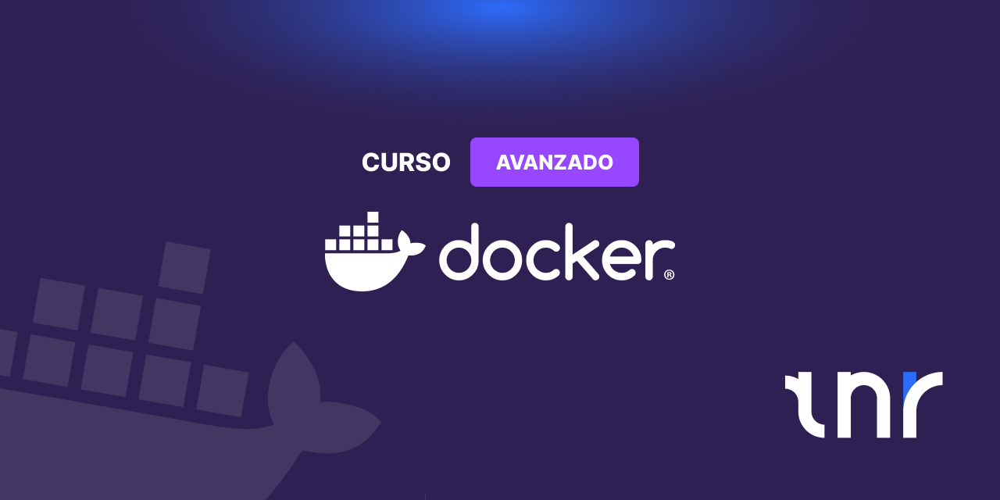

# Curso Avanzado Docker

Autor: Arturo Silvelo  
Empresa: Try New Roads

---

## Índice del curso

1. Dockerfile avanzado y optimización de imágenes

   - Multi-stage builds: Crear imágenes ligeras con etapas separadas.
   - Optimización de capas: Minimizar capas y aprovechar cache.
   - ARG y ENV: Uso de variables para configuración.
   - Gestión de secretos: Evitar exponer datos sensibles.

2. Docker Compose avanzado

   - Anchors y extends: Reutilizar configuraciones YAML comunes.
   - Healthcheck: Comprobación y dependencias de servicios.
   - Entornos: Gestión de variables de entorno y configuraciones para múltiples entornos.

3. Volúmenes y persistencia avanzada

   - Backup con contenedores: Crear y restaurar backups con tar.
   - Backups consistentes: Estrategias para bases de datos.

4. Docker Registry privado

   - Desplegar registry privado: Montaje y configuración básica.
   - Gestionar imágenes: Subir, eliminar y mantener el registry.

5. Orquestación con Docker Swarm

   - Clúster local: Crear entorno de pruebas.
   - Despliegue: Gestionar stacks y rollback.
   - Escalado: Ajustar réplicas.
   - Red overlay: Comunicación entre nodos.
   - Secrets: Gestionar datos sensibles.

6. Monitorización y debugging (opcional)
   - Drivers logging: Centralizar logs con distintos drivers.
   - Herramientas monitorización: Uso de `docker stats`, Prometheus.
   - Debugging contenedores: Técnicas para análisis en tiempo real.

---

## Estructura del repositorio

El repositorio está organizado en carpetas por módulos temáticos. Cada módulo contiene:

- `/ejemplos/`: Ejemplos prácticos y código de referencia.
- `/ejercicios/`: Ejercicios propuestos para practicar.
- `/slides/`: Presentaciones Marp para cada tema.
- `/soluciones/`: Soluciones a los ejercicios.
- `/img/`: Imágenes usadas en las slides y documentación.

Por ejemplo:

- `01-dockerfile-avanzado/`
- `02-docker-compose-avanzado/`
- `03-volumenes-persistencia-avanzada/`
- ...

El archivo `README.md` contiene el índice general del curso. Las slides completas están en la carpeta `/slides/` de cada módulo y en `slides/curso-avanzado-docker.md` para la visión global.
