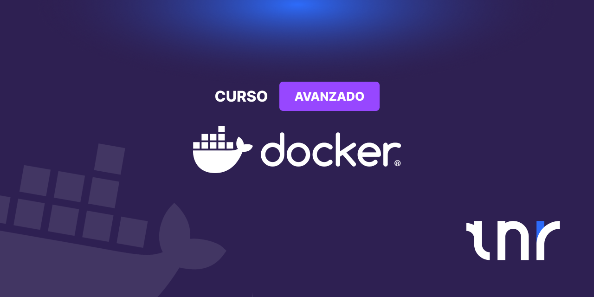

# Curso Avanzado Docker

Autor: Arturo Silvelo  
Empresa: Try New Roads

---

## Índice del curso

1. Dockerfile

   - ¿Que és?
   - Optimización
   - Capas
   - Args y Env
   - Secretos
   - Seguridad

2. Docker Compose

   - ¿Que és?
   - Fragmentos
   - Extensiones
   - Health Check
   - Gestión Entornos
     - Múltiple ENV
     - Múltiple Compose
   - Compose Specifications

3. Almacenamiento

   - Tipos
   - Volume
     - Gestión
     - Named & Anonymous
     - mount vs volume
     - Subdirectorios
     - Compartición entre contenedores
     - Backup, Restauración y migración
   - Bind
     - mount vs volume
   - tmpfs

4. Swarm

5. Gestión

---

## Estructura del repositorio

El repositorio está organizado en carpetas por módulos temáticos. Cada módulo contiene:

- `/ejemplos/`: Ejemplos prácticos y código de referencia.
- `/ejercicios/`: Ejercicios propuestos para practicar.
- `/slides/`: Presentaciones Marp para cada tema.
- `/soluciones/`: Soluciones a los ejercicios.
- `/img/`: Imágenes usadas en las slides y documentación.

Por ejemplo:

- `01-dockerfile-avanzado/`
- `02-docker-compose-avanzado/`
- `03-volumenes-persistencia-avanzada/`
- ...

El archivo `README.md` contiene el índice general del curso. Las slides completas están en la carpeta `/slides/` de cada módulo y en `slides/curso-avanzado-docker.md` para la visión global.

## Clonado del repositorio con submódulos

Este repositorio contiene submódulos (otros repositorios incluidos dentro de carpetas). Para clonar correctamente y tener todo el contenido, sigue una de estas opciones:

**Opción 1: Clonar desde cero (recomendado)**

```bash
git clone --recurse-submodules git@github.com:trynewroads/docker-course-advance.git
```

**Opción 2: Si ya has clonado el repositorio sin submódulos**

```bash
git submodule update --init --recursive
```

Esto descargará los submódulos en las rutas y versiones correctas.
